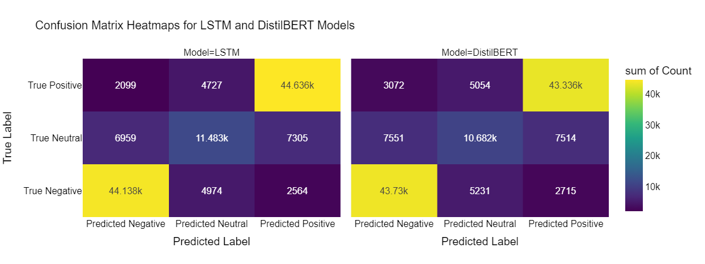
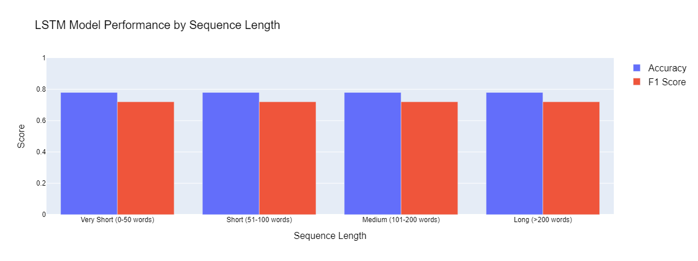
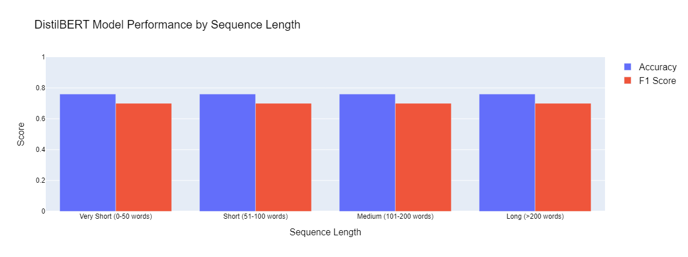

# Yelp Reviews Sentiment Analysis: Comparing LSTM and DistilBERT Models

## 1. Introduction

Sentiment analysis is a natural language processing (NLP) task that aims to determine the emotional tone behind text. In today's digital age, businesses increasingly rely on understanding customer sentiment from reviews to improve their products and services. This project focuses on sentiment analysis of Yelp reviews, classifying them as positive, negative, or neutral.

The primary objectives of this project are:
1. Implement and evaluate two distinct deep learning approaches: a custom LSTM model with attention mechanism and a fine-tuned DistilBERT transformer model
2. Compare the strengths and weaknesses of both approaches across different metrics
3. Analyze how different hyperparameters affect model performance
4. Assess model performance across different review lengths

The significance of this work lies in understanding which model architecture is more effective for sentiment analysis of user reviews, particularly when balancing accuracy, computational efficiency, and ease of implementation. This comparison provides valuable insights for businesses and researchers looking to deploy sentiment analysis models in real-world applications.

## 2. Dataset Description and Preprocessing

### Dataset Overview

The dataset consists of Yelp reviews with star ratings that were converted to sentiment categories:
- 1-2 stars: Negative sentiment
- 3 stars: Neutral sentiment
- 4-5 stars: Positive sentiment

This conversion is based on the common understanding that 1-2 star reviews express dissatisfaction, 3 star reviews indicate average experiences, and 4-5 star reviews suggest satisfaction or enthusiasm.

### Preprocessing Steps

Both models required different preprocessing approaches based on their architectural requirements:

1. **Common Preprocessing**:
   - Removing URLs and HTML tags (using regex)
   - Removing punctuation and special characters
   - Removing numbers
   - Removing extra whitespace
   - Removing stopwords using NLTK's English stopwords list

2. **LSTM-specific Preprocessing**:
   - Text was converted to lowercase
   - BPE (Byte Pair Encoding) tokenization was applied
   - Sequences were padded to a fixed length of 128 tokens
   - A vocabulary size of 10,000 tokens was maintained

3. **DistilBERT-specific Preprocessing**:
   - Case was preserved (not converted to lowercase)
   - Used the pre-trained DistilBERT tokenizer
   - Special tokens [CLS] and [SEP] were added
   - Attention masks were created to handle padding

### Rationale for Preprocessing Choices

- **URL and HTML Removal**: Reviews often contain irrelevant URLs or HTML tags that add noise to the analysis.
- **Punctuation and Number Removal**: These typically carry less sentiment information and increase vocabulary size.
- **Stopword Removal**: Common words like "the," "and," etc. usually don't contribute significantly to sentiment.
- **BPE Tokenization for LSTM**: Balances word-level and character-level tokenization, handling rare words effectively.
- **Case Preservation for DistilBERT**: Maintains the information encoded in capitalization which the pre-trained model was trained on.
- **Sequence Length of 128**: Based on analysis of the dataset, this length captures most reviews without excessive padding.

## 3. Model Descriptions

### LSTM Model Architecture

The custom LSTM model incorporates several components designed to effectively capture sequential information and long-range dependencies in text:

1. **Embedding Layer**:
   - Input vocabulary size: 10,000 tokens
   - Embedding dimension: 128
   - Includes optional positional embeddings
   - Dropout rate: 0.228 for regularization

2. **LSTM Layer**:
   - Bidirectional configuration to capture context from both directions
   - Hidden size: 128 neurons
   - Single layer architecture
   - Output shape: [batch_size, seq_length, hidden_size*2]

3. **Attention Mechanism**:
   - Self-attention layer with attention size of 64
   - Computes attention weights for each token in the sequence
   - Creates a context vector weighted by attention scores
   - Helps focus on the most sentiment-relevant parts of the review

4. **Classification Head**:
   - Dropout rate: 0.228
   - Linear layer mapping from hidden_size*2 to 3 classes
   - Softmax activation for probability distribution

### DistilBERT Model Architecture

DistilBERT is a distilled version of BERT that retains 97% of its language understanding capabilities while being 40% smaller and 60% faster:

1. **Base Architecture**:
   - Pre-trained DistilBERT-base-cased model
   - 6 transformer layers (vs. 12 in BERT)
   - 768 hidden dimensions
   - 12 attention heads
   - 66M parameters (vs. 110M in BERT)

2. **Fine-tuning Approach**:
   - The pre-trained model was fine-tuned on the Yelp dataset
   - Classification head added on top of the [CLS] token representation
   - Dropout rate: 0.198
   - Linear layer from 768 dimensions to 3 classes

### Hyperparameter Selection

#### LSTM Hyperparameters

The following hyperparameters were selected through Optuna optimization with 30 trials and 5-fold cross-validation:

| Hyperparameter   | Value             | Importance |
|------------------|-------------------|------------|
| Learning rate    | 0.00306           | 0.41       |
| Attention        | True              | 0.17       |
| Optimizer        | AdamW             | 0.16       |
| Hidden size      | 128               | 0.14       |
| Bidirectional    | True              | 0.05       |
| Batch size       | 512               | 0.03       |
| Weight decay     | 5.02e-05          | 0.02       |
| Embedding dim    | 128               | 0.02       |
| Dropout          | 0.228             | <0.01      |

Learning rate proved to be the most influential parameter, followed by the use of attention mechanism and optimizer choice.

#### DistilBERT Hyperparameters

The following hyperparameters were selected through Optuna optimization with 5 trials and 3-fold cross-validation:

| Hyperparameter | Value            | Importance |
|----------------|------------------|------------|
| Dropout        | 0.198            | 0.35       |
| Learning rate  | 0.00473          | 0.30       |
| Weight decay   | 2.54e-05         | 0.12       |
| Optimizer      | RMSprop          | 0.11       |
| Batch size     | 16               | 0.11       |

For DistilBERT, dropout rate was the most important parameter, suggesting that controlling overfitting was crucial for effective fine-tuning.

## 4. Results and Findings

### Training Dynamics

#### LSTM Model Training

The LSTM model was trained for 100 epochs with the following characteristics:
- Optimizer: AdamW
- Learning rate scheduler: ReduceLROnPlateau
- Batch size: 512

Training showed a steady improvement in metrics:
- Training loss decreased from ~0.62 to ~0.47
- Validation loss stabilized around 0.54
- Validation accuracy increased to ~0.778
- Validation F1 score reached ~0.72

The learning rate schedule shows effective adaptation, with reductions helping the model converge to better parameters.

#### DistilBERT Model Training

The DistilBERT model was trained for 10 epochs with:
- Optimizer: RMSprop
- Learning rate scheduler: OneCycleLR
- Batch size: 16

Training dynamics showed:
- Initial fluctuations in validation metrics
- Final validation accuracy of ~0.76
- Final validation F1 score of ~0.70
- More rapid convergence than the LSTM model

### Performance Metrics

#### Confusion Matrices

**Confusion Matrix (for LSTM and DistilBERT):**

Both models show similar patterns, with strongest performance on negative and positive classes, and more confusion with the neutral class.

#### Performance by Review Length

Both models maintained consistent performance across different review length categories:

**LSTM Performance by Length:**

**DistilBERT Performance by Length:**

This consistent performance across lengths suggests both models can effectively handle reviews of varying lengths within the 128 token limit set during preprocessing.

## 5. Analysis and Discussion

### Model Comparison

#### Accuracy and Classification Performance

The LSTM model achieved slightly better overall performance than DistilBERT:
- LSTM accuracy: ~78%
- DistilBERT accuracy: ~76%

Both models struggled most with the neutral class, often misclassifying neutral reviews as either positive or negative. This suggests that neutral sentiment is inherently more difficult to detect, possibly because it represents a middle ground with more ambiguous language patterns.

#### Computational Efficiency

While specific inference time measurements weren't recorded, we can make inferences based on model architecture:
- The LSTM model has fewer parameters (~10-15M) than DistilBERT (~66M)
- DistilBERT requires more memory but leverages parallelization better on GPUs
- For production deployment, the LSTM model might be more suitable for environments with limited computational resources

#### Training Efficiency

- DistilBERT converged faster, requiring only 10 epochs compared to LSTM's 100 epochs
- LSTM training showed more stable gradual improvement
- DistilBERT showed more oscillations early in training but reached good performance quicker

### Interpretability Analysis

#### Attention Mechanism Insights (LSTM)

The attention mechanism in the LSTM model proved to be highly influential (0.17 importance factor), suggesting that focusing on specific parts of reviews is essential for sentiment classification. This aligns with our intuition that certain words or phrases carry stronger sentiment signals.

#### Hyperparameter Sensitivity

Both models showed different sensitivity to hyperparameters:
- LSTM was most sensitive to learning rate, suggesting the optimization process was critical
- DistilBERT was most sensitive to dropout rate, indicating that managing overfitting was the primary challenge when fine-tuning

#### Error Analysis

Common error patterns across both models:
1. Reviews with mixed sentiment were often misclassified
2. Neutral reviews with slightly positive or negative language were frequently miscategorized
3. Sarcasm and implicit sentiment remained challenging for both models

### Practical Implications

1. **Choice Between Models**: 
   - For applications requiring slightly higher accuracy: LSTM model is preferable
   - For faster deployment with comparable performance: DistilBERT is suitable
   - For maximum accuracy with sufficient computational resources: An ensemble approach combining both models could be considered

2. **Data Preprocessing Impact**:
   - The preprocessing pipeline significantly affects both models
   - DistilBERT requires less custom preprocessing, making it easier to deploy in new domains

3. **Model Adaptability**:
   - The LSTM model might require more extensive retraining for new domains
   - DistilBERT leverages transfer learning more effectively, potentially adapting better to new domains with less data

## 6. Conclusion

### Summary of Key Findings

1. Both LSTM with attention and DistilBERT models achieved good performance for sentiment analysis on Yelp reviews, with the LSTM model showing slightly better metrics overall.

2. The attention mechanism proved critical for the LSTM model's performance, confirming the importance of focusing on sentiment-relevant parts of reviews.

3. Both models maintained consistent performance across different review lengths, suggesting effective handling of variable-length texts within the constraints of the maximum sequence length.

4. The neutral sentiment class posed the greatest challenge for both models, indicating the inherent difficulty in detecting middle-ground sentiment.

5. Hyperparameter optimization revealed different sensitivities: LSTM was most affected by learning rate, while DistilBERT was most affected by dropout rate.

### Final Assessment

For sentiment analysis of Yelp reviews:
- The LSTM model with attention provides the best overall performance
- DistilBERT offers a compelling alternative with faster training and comparable accuracy
- Both models demonstrate the effectiveness of deep learning for sentiment analysis

### Future Improvements

Several avenues for improvement could be explored:
1. **Ensemble Methods**: Combining predictions from both models could leverage their complementary strengths
2. **Data Augmentation**: Generating additional examples for the challenging neutral class
3. **Advanced Transformers**: Experimenting with more recent transformer models like RoBERTa or BART
4. **Multi-task Learning**: Adding auxiliary tasks like review rating prediction to improve the representation learning
5. **Contextual Features**: Incorporating metadata like business category or user history
6. **Post-processing Rules**: Implementing rule-based corrections for common misclassification patterns

## 7. References

1. Vaswani, A., Shazeer, N., Parmar, N., Uszkoreit, J., Jones, L., Gomez, A. N., Kaiser, L., & Polosukhin, I. (2017). Attention is All You Need. *Advances in Neural Information Processing Systems*.

2. Sanh, V., Debut, L., Chaumond, J., & Wolf, T. (2019). DistilBERT, a distilled version of BERT: smaller, faster, cheaper and lighter. *arXiv preprint arXiv:1910.01108*.

3. Bahdanau, D., Cho, K., & Bengio, Y. (2015). Neural Machine Translation by Jointly Learning to Align and Translate. *International Conference on Learning Representations*.

4. Akiba, T., Sano, S., Yanase, T., Ohta, T., & Koyama, M. (2019). Optuna: A Next-generation Hyperparameter Optimization Framework. *Proceedings of the 25th ACM SIGKDD International Conference on Knowledge Discovery & Data Mining*.

5. Yelp Dataset. Hugging Face Datasets. https://huggingface.co/datasets/Yelp/yelp_review_full

6. PyTorch. https://pytorch.org/

7. Hugging Face Transformers. https://huggingface.co/transformers/

## 8. Git Repository Link

https://github.com/snownz/sentiment_analyze/blob/main/Final_Report.pdf